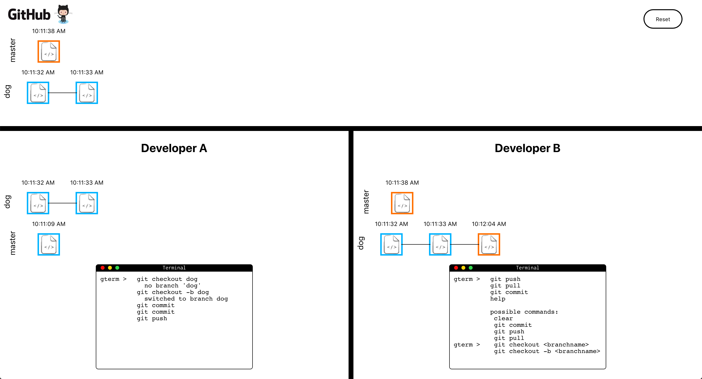

# Git With It

The design goal for this project is to create a learning tool to allow students to visualize git commands.

## Getting Started

These instructions will get you a copy of the project up and running on your local machine for development and testing purposes.
  ```
  npm clone https://github.com/chris023/git-with-it.git
  npm install
  npm start
  ```

### Prerequisites

What things you need to install the software and how to install them

[npm](https://www.npmjs.com/get-npm)

## Built With

* [React](https://reactjs.org/) - The web framework used
* [npm](https://www.npmjs.com/) - Dependency Management

## Authors

* **Chris Meyer** - *Initial work*

## Issues

* See issues

## Screenshots

